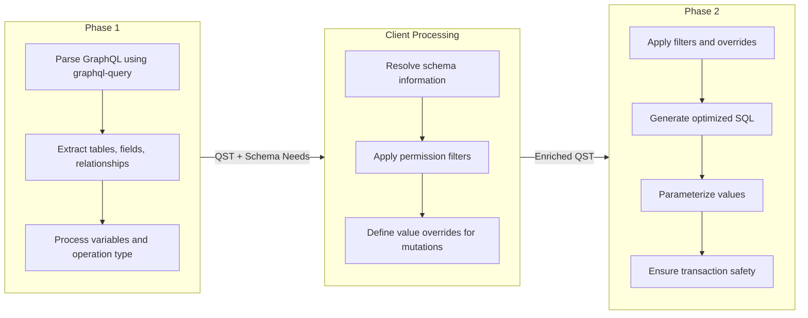
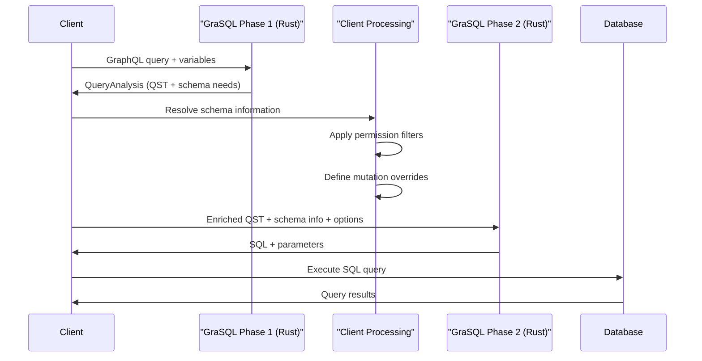

# GraSQL Architecture

GraSQL is a high-performance GraphQL to SQL compiler written in Elixir with Rust (via Rustler) for compute-intensive operations. It's designed to efficiently transform GraphQL queries into optimized SQL, with a focus on performance, memory efficiency, and developer ergonomics.

## Design Principles

1. **Performance First**: Optimized for high-throughput environments (100,000+ queries/second)
2. **Memory Efficiency**: Minimal memory footprint per query
3. **Developer Ergonomics**: Clean, intuitive API that's easy to use correctly
4. **Separation of Concerns**: Clear boundaries between phases
5. **Minimalism**: Focus on doing one thing extremely well

## High-Level Architecture

GraSQL uses a two-phase compilation strategy that balances performance with flexibility:



## Core Components

### 1. Query Structure Tree (QST)

The QST is a database-agnostic representation of a GraphQL query. It captures:

- Operation type (query, mutation)
- Selected fields and their relationships
- Filter conditions and arguments
- Variables and their types

The QST is initially created during Phase 1 and then enriched with schema and permission information by the client before SQL generation in Phase 2.

### 2. Parser Module

Uses the high-performance [graphql-query](https://github.com/StellateHQ/graphql-query) library to:

- Parse GraphQL syntax
- Extract operation structure
- Process variables and arguments
- Identify schema requirements

### 3. Schema Resolution

Schema information is provided by the client based on the specific needs of a query:

- Tables and their columns
- Relationships between tables
- Primary keys and types
- Cross-schema relationships

This approach ensures minimal memory overhead by only including schema information relevant to the current query.

### 4. Permission System

GraSQL supports flexible permission rules through filters and overrides:

```elixir
# Examples of permission filters
Equal.new(ColumnRef.new("users.id"), UserId)
Or.new([
  Equal.new(ColumnRef.new("posts.user_id"), UserId),
  Equal.new(ColumnRef.new("posts.is_public"), true)
])
```

**Overrides**: Modifications applied to mutations

```elixir
# Examples of mutation overrides
SetValue.new(ColumnRef.new("posts.updated_at"), CurrentTimestamp)
SetValue.new(ColumnRef.new("posts.created_by"), UserId)
```

### 5. SQL Generator

Generates optimized PostgreSQL queries with features including:

- Efficient joins and relationship handling
- Parameterized queries for security
- JSON aggregation for nested queries
- Transaction-safe operations

## API Design

GraSQL provides a clean, focused API that emphasizes both performance and usability:

### Phase 1: Analyze Query

```elixir
@spec analyze_query(query :: String.t(), variables :: map()) ::
  {:ok, QueryAnalysis.t()} | {:error, ParseError.t()}
def analyze_query(query, variables) do
  # Implementation
end
```

Returns:

- `QueryAnalysis` containing the initial QST and schema needs
- Information about required tables, columns and relationships
- Processed variables

### Phase 2: Generate SQL

```elixir
@spec generate_sql(
  analysis :: QueryAnalysis.t(),
  schema_info :: SchemaInfo.t(),
  options :: SqlGenOptions.t()
) :: {:ok, SqlResult.t()} | {:error, SqlError.t()}
def generate_sql(analysis, schema_info, options) do
  # Implementation
end
```

Where:

```elixir
defmodule GraSQL.SqlGenOptions do
  defstruct [
    permissions: [],  # Permission filters
    overrides: [],    # Value overrides for mutations
    include_metadata: false # Include table/field metadata
  ]

  @type t :: %__MODULE__{
    permissions: list(Filter.t()),
    overrides: list(Override.t()),
    include_metadata: boolean()
  }
end
```

Returns:

```elixir
defmodule GraSQL.SqlResult do
  defstruct [
    sql: "",              # Generated SQL query
    parameters: [],       # Parameter values
    parameter_types: []   # Parameter type information
  ]

  @type t :: %__MODULE__{
    sql: String.t(),
    parameters: list(any()),
    parameter_types: list(String.t())
  }
end
```

## Schema Management

Schema information is structured to be efficient and cross-schema aware:

```elixir
defmodule GraSQL.SchemaInfo do
  defstruct [
    tables: [],
    relationships: []
  ]

  @type t :: %__MODULE__{
    tables: list(TableInfo.t()),
    relationships: list(RelationshipInfo.t())
  }
end

defmodule GraSQL.TableInfo do
  defstruct [
    schema: "",           # Database schema
    name: "",             # Table name
    primary_key: [],      # Primary key columns
    columns: []           # Column information
  ]

  @type t :: %__MODULE__{
    schema: String.t(),
    name: String.t(),
    primary_key: list(String.t()),
    columns: list(ColumnInfo.t())
  }
end
```

## Data Flow



## Performance Optimizations

GraSQL is designed from the ground up to deliver exceptional performance. Based on benchmarks of underlying components and our current system performance, we've established aggressive yet achievable performance targets:

### Performance Targets

| Component                       | Target Performance | Current System | Improvement |
| ------------------------------- | ------------------ | -------------- | ----------- |
| GraphQL parsing/validation      | <50μs              | ~1ms           | ~20x        |
| Query analysis + SQL generation | <500μs             | ~2ms           | ~4x         |
| Total pre-database time         | <1ms               | ~3ms           | ~3x         |
| Sustained QPS                   | 15-25K+            | ~10K           | ~1.5-2.5x   |
| Burst QPS                       | 40-50K+            | ~15K           | ~2.5-3.5x   |
| End-to-end P50                  | <10ms              | ~20ms          | ~2x         |
| End-to-end P95                  | <25ms              | ~50ms          | ~2x         |
| End-to-end P99                  | <50ms              | ~100ms         | ~2x         |

These targets are still extremely ambitious while acknowledging system realities:

- **NIF overhead**: Accounts for the Elixir/Rust boundary crossing overhead
- **Query complexity**: Allows appropriate time for analysis of complex queries and permissions
- **Database reality**: Acknowledges that end-to-end time includes database execution, which typically takes several milliseconds
- **Hardware scaling**: QPS targets represent major throughput improvements achievable on standard hardware

### Optimization Strategies

1. **Zero-Copy Parsing**: The [graphql-query](https://github.com/StellateHQ/graphql-query) Rust library minimizes allocations during GraphQL parsing with benchmark results showing exceptional performance:

   ```
   graphql_ast_parse_graphql_query: 2,886 ns/iter
   graphql_ast_validate: 1,504 ns/iter
   graphql_ast_print_graphql_query: 1,082 ns/iter
   ```

2. **Minimal Schema Resolution**: Only resolves schema information for tables and fields actually used in the query, reducing memory overhead and computation time.

3. **Efficient BEAM/Rust Interface**: Strategic design of the Elixir-Rust boundary to minimize crossings:

   - Single round-trip per processing phase
   - Initially using Rustler's default serialization (ETF via serde)
   - Measurement-driven optimization of boundary crossings

4. **Efficient Data Structures**: Custom data structures optimized for query representation:

   - Pre-allocated capacity based on query analysis
   - Cache-friendly memory layouts
   - Minimal indirection and pointer chasing

5. **Query Plan Optimization**:

   - Filter push-down to minimize rows processed
   - Join order selection based on cardinality
   - Subquery optimization for complex hierarchies
   - Smart pagination strategies (keyset vs offset)

6. **Parameter Optimization**:

   - Efficient mapping of variables to SQL parameters
   - Type-aware parameter handling
   - Batch parameterization of similar values

7. **Memory Management**:
   - Careful control of allocations with arena strategies
   - Buffer reuse for similar queries
   - Avoidance of unnecessary copies
   - Capacity pre-allocation where size is predictable

### Implementation Priorities

The performance optimization effort will focus on these key areas:

1. **Measurement**: Comprehensive benchmarking with realistic workloads to establish baseline and track improvements

2. **Hot Paths**: Identifying and optimizing the most frequently executed code paths:

   - GraphQL parsing and validation
   - SQL generation for common query patterns
   - JSON result structure construction

3. **Data Flow**: Optimizing the flow of data through the system:

   - Minimizing transformations between representations
   - Eliminating redundant processing
   - Strategic caching of intermediate results

4. **Concurrency**: Ensuring efficient execution under high load:
   - Non-blocking processing pipelines
   - Efficient use of available cores
   - Thread coordination with minimal synchronization

With these optimizations, GraSQL aims to provide best-in-class performance while maintaining a clean, maintainable codebase and developer-friendly API.

## Usage Example

```elixir
# Sample workflow
def execute_graphql(query, variables, user_id) do
  # Phase 1: Analyze the query
  case GraSQL.analyze_query(query, variables) do
    {:ok, analysis} ->
      # Gather schema info for required tables
      schema_info = DB.get_schema_for(analysis.schema_needs)

      # Define permission filters
      options = %GraSQL.SqlGenOptions{
        permissions: [
          Filter.equal(ColumnRef.new("users.id"), user_id),
          Filter.or([
            Filter.equal(ColumnRef.new("posts.user_id"), user_id),
            Filter.equal(ColumnRef.new("posts.is_public"), true)
          ])
        ],
        overrides: [
          Override.set_value(ColumnRef.new("posts.updated_at"), current_timestamp())
        ],
        include_metadata: false
      }

      # Phase 2: Generate SQL
      case GraSQL.generate_sql(analysis, schema_info, options) do
        {:ok, sql_result} ->
          # Execute the query
          DB.execute(sql_result.sql, sql_result.parameters)

        {:error, error} ->
          handle_sql_error(error)
      end

    {:error, error} ->
      handle_parse_error(error)
  end
end
```

## Transaction Safety

GraSQL ensures all generated SQL is safe to use in transactions by:

1. Using proper parameter binding to prevent injection
2. Avoiding non-deterministic functions where inappropriate
3. Properly isolating subqueries
4. Managing joins and relations to maintain consistency

## Future Extensions

While focusing on PostgreSQL initially, GraSQL is designed with clean interfaces that will allow future support for:

1. Additional database dialects
2. Enhanced optimization strategies
3. More sophisticated permission models
4. Extended GraphQL feature support
