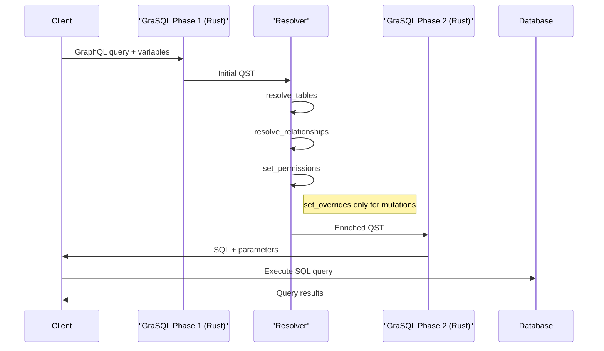

# GraSQL Architecture

GraSQL is a high-performance GraphQL to SQL compiler written in Elixir with Rust (via Rustler) for compute-intensive operations. It's designed to efficiently transform GraphQL queries into optimized SQL, with a focus on performance, memory efficiency, and developer ergonomics.

## Design Principles

1. **Performance First**: Optimized for high-throughput environments (100,000+ queries/second)
2. **Memory Efficiency**: Minimal memory footprint per query
3. **Developer Ergonomics**: Clean, intuitive API that's easy to use correctly
4. **Separation of Concerns**: Clear boundaries between phases
5. **Minimalism**: Focus on doing one thing extremely well

## High-Level Architecture

GraSQL uses a structured resolver approach that balances performance with flexibility:

```mermaid
flowchart LR
    subgraph Phase1["Phase 1"]
      direction TB
      A1[Parse GraphQL using graphql-query] --> A2[Extract tables, fields, relationships]
      A2 --> A3[Process variables and operation type]
    end

    subgraph ResolverProcessing["Resolver Processing"]
      direction TB
      B1[Resolve tables] --> B2[Resolve relationships]
      B2 --> B3[Set permissions]
      B3 --> B4[Set overrides (mutations only)]
    end

    subgraph Phase2["Phase 2"]
      direction TB
      C1[Apply filters and overrides] --> C2[Generate optimized SQL]
      C2 --> C3[Parameterize values]
      C3 --> C4[Ensure transaction safety]
    end

    Phase1 -->|Initial QST| ResolverProcessing
    ResolverProcessing -->|Enriched QST| Phase2
```

## Core Components

### 1. Query Structure Tree (QST)

The QST is a database-agnostic representation of a GraphQL query. It captures:

- Operation type (query, mutation)
- Selected fields and their relationships
- Filter conditions and arguments
- Variables and their types

The QST is initially created during Phase 1 and then enriched by the resolver methods before SQL generation in Phase 2.

### 2. Parser Module

Uses the high-performance [graphql-query](https://github.com/StellateHQ/graphql-query) library to:

- Parse GraphQL syntax
- Extract operation structure
- Process variables and arguments
- Identify schema requirements

### 3. Resolver Interface

A central part of GraSQL is the resolver interface, which requires four key methods:

1. **resolve_tables/1**: Maps GraphQL types to database tables and their columns
2. **resolve_relationships/1**: Defines relationships between tables
3. **set_permissions/1**: Applies access control rules through filters
4. **set_overrides/1**: Provides value overrides for mutations (only called for mutations)

This structured approach ensures a clear separation of concerns while giving applications complete control over schema mapping and permissions.

### 4. Permission System

GraSQL supports flexible permission rules through the resolver's `set_permissions` method:

```elixir
# Examples of permission filters that might be added in set_permissions
def set_permissions(qst) do
  Map.update(qst, :permissions, [], fn current_permissions ->
    [
      %{field: "users.id", operation: "equals", value: current_user_id()},
      %{
        operation: "or",
        conditions: [
          %{field: "posts.user_id", operation: "equals", value: current_user_id()},
          %{field: "posts.is_public", operation: "equals", value: true}
        ]
      }
      | current_permissions
    ]
  end)
end
```

**Overrides**: Modifications applied to mutations via the `set_overrides` method:

```elixir
# Examples of mutation overrides that might be added in set_overrides
def set_overrides(qst) do
  Map.update(qst, :overrides, [], fn current_overrides ->
    [
      %{field: "posts.updated_at", value: :current_timestamp},
      %{field: "posts.updated_by", value: current_user_id()}
      | current_overrides
    ]
  end)
end
```

### 5. SQL Generator

Generates optimized PostgreSQL queries with features including:

- Efficient joins and relationship handling
- Parameterized queries for security
- JSON aggregation for nested queries
- Transaction-safe operations

## API Design

GraSQL provides a clean, focused API that emphasizes both performance and usability:

### Generate SQL

```elixir
@spec generate_sql(
  query :: String.t(),
  variables :: map() | String.t(),
  resolver :: module()
) :: {:ok, SqlResult.t()} | {:error, Error.t()}
def generate_sql(query, variables, resolver) do
  # Implementation
end
```

The resolver module must implement these methods:

```elixir
# Maps GraphQL types to database tables
@spec resolve_tables(qst :: map()) :: map()
def resolve_tables(qst)

# Defines relationships between tables
@spec resolve_relationships(qst :: map()) :: map()
def resolve_relationships(qst)

# Applies access control rules
@spec set_permissions(qst :: map()) :: map()
def set_permissions(qst)

# Provides value overrides for mutations (only called for mutations)
@spec set_overrides(qst :: map()) :: map()
def set_overrides(qst)
```

Result structure:

```elixir
defmodule GraSQL.SqlResult do
  defstruct [
    sql: "",              # Generated SQL query
    parameters: [],       # Parameter values
    parameter_types: []   # Parameter type information
  ]

  @type t :: %__MODULE__{
    sql: String.t(),
    parameters: list(any()),
    parameter_types: list(String.t())
  }
end
```

## Data Flow



## Performance Optimizations

GraSQL is designed from the ground up to deliver exceptional performance. Based on benchmarks of underlying components and our current system performance, we've established aggressive yet achievable performance targets:

### Performance Targets

| Component                       | Target Performance | Current System | Improvement |
| ------------------------------- | ------------------ | -------------- | ----------- |
| GraphQL parsing/validation      | <50μs              | ~1ms           | ~20x        |
| Query analysis + SQL generation | <500μs             | ~2ms           | ~4x         |
| Total pre-database time         | <1ms               | ~3ms           | ~3x         |
| Sustained QPS                   | 15-25K+            | ~10K           | ~1.5-2.5x   |
| Burst QPS                       | 40-50K+            | ~15K           | ~2.5-3.5x   |
| End-to-end P50                  | <10ms              | ~20ms          | ~2x         |
| End-to-end P95                  | <25ms              | ~50ms          | ~2x         |
| End-to-end P99                  | <50ms              | ~100ms         | ~2x         |

These targets are still extremely ambitious while acknowledging system realities:

- **NIF overhead**: Accounts for the Elixir/Rust boundary crossing overhead
- **Query complexity**: Allows appropriate time for analysis of complex queries and permissions
- **Database reality**: Acknowledges that end-to-end time includes database execution, which typically takes several milliseconds
- **Hardware scaling**: QPS targets represent major throughput improvements achievable on standard hardware

### Optimization Strategies

1. **Zero-Copy Parsing**: The [graphql-query](https://github.com/StellateHQ/graphql-query) Rust library minimizes allocations during GraphQL parsing with benchmark results showing exceptional performance:

   ```
   graphql_ast_parse_graphql_query: 2,886 ns/iter
   graphql_ast_validate: 1,504 ns/iter
   graphql_ast_print_graphql_query: 1,082 ns/iter
   ```

2. **Minimal Schema Resolution**: Only resolves schema information for tables and fields actually used in the query, reducing memory overhead and computation time.

3. **Efficient BEAM/Rust Interface**: Strategic design of the Elixir-Rust boundary to minimize crossings:

   - Single round-trip per processing phase
   - Initially using Rustler's default serialization (ETF via serde)
   - Measurement-driven optimization of boundary crossings

4. **Efficient Data Structures**: Custom data structures optimized for query representation:

   - Pre-allocated capacity based on query analysis
   - Cache-friendly memory layouts
   - Minimal indirection and pointer chasing

5. **Query Plan Optimization**:

   - Filter push-down to minimize rows processed
   - Join order selection based on cardinality
   - Subquery optimization for complex hierarchies
   - Smart pagination strategies (keyset vs offset)

6. **Parameter Optimization**:

   - Efficient mapping of variables to SQL parameters
   - Type-aware parameter handling
   - Batch parameterization of similar values

7. **Memory Management**:
   - Careful control of allocations with arena strategies
   - Buffer reuse for similar queries
   - Avoidance of unnecessary copies
   - Capacity pre-allocation where size is predictable

### Implementation Priorities

The performance optimization effort will focus on these key areas:

1. **Measurement**: Comprehensive benchmarking with realistic workloads to establish baseline and track improvements

2. **Hot Paths**: Identifying and optimizing the most frequently executed code paths:

   - GraphQL parsing and validation
   - SQL generation for common query patterns
   - JSON result structure construction

3. **Data Flow**: Optimizing the flow of data through the system:

   - Minimizing transformations between representations
   - Eliminating redundant processing
   - Strategic caching of intermediate results

4. **Concurrency**: Ensuring efficient execution under high load:
   - Non-blocking processing pipelines
   - Efficient use of available cores
   - Thread coordination with minimal synchronization

With these optimizations, GraSQL aims to provide best-in-class performance while maintaining a clean, maintainable codebase and developer-friendly API.

## Usage Example

```elixir
# Sample resolver implementation
defmodule MyApp.Resolver do
  def resolve_tables(qst) do
    # Map GraphQL types to database tables
    # Example: add table info to QST based on types
    Map.update(qst, :tables, %{}, fn tables ->
      Map.merge(tables, %{
        "User" => %{schema: "public", table: "users", columns: ["id", "name", "email"]},
        "Post" => %{schema: "public", table: "posts", columns: ["id", "title", "content", "user_id"]}
      })
    end)
  end

  def resolve_relationships(qst) do
    # Define relationships between tables
    # Example: add relationship info to QST
    Map.update(qst, :relationships, %{}, fn relationships ->
      Map.merge(relationships, %{
        "User.posts" => %{
          parent_table: "users",
          child_table: "posts",
          parent_key: "id",
          child_key: "user_id"
        }
      })
    end)
  end

  def set_permissions(qst) do
    # Apply permission filters
    # Example: add permission filters to QST
    Map.update(qst, :permissions, [], fn permissions ->
      [
        %{field: "users.id", operation: "equals", value: current_user_id()},
        %{
          operation: "or",
          conditions: [
            %{field: "posts.user_id", operation: "equals", value: current_user_id()},
            %{field: "posts.is_public", operation: "equals", value: true}
          ]
        }
        | permissions
      ]
    end)
  end

  def set_overrides(qst) do
    # Set overrides for mutations
    # Example: add value overrides to QST
    Map.update(qst, :overrides, [], fn overrides ->
      [
        %{field: "posts.updated_at", value: :current_timestamp},
        %{field: "posts.updated_by", value: current_user_id()}
        | overrides
      ]
    end)
  end

  defp current_user_id do
    # Implementation to get current user ID
    "current-user-123"
  end
end

# Sample workflow
def execute_graphql(query, variables, _user_id) do
  # Generate SQL using the resolver
  case GraSQL.generate_sql(query, variables, MyApp.Resolver) do
    {:ok, sql_result} ->
      # Execute the query
      DB.execute(sql_result.sql, sql_result.parameters)

    {:error, error} ->
      handle_error(error)
  end
end
```

## Transaction Safety

GraSQL ensures all generated SQL is safe to use in transactions by:

1. Using proper parameter binding to prevent injection
2. Avoiding non-deterministic functions where inappropriate
3. Properly isolating subqueries
4. Managing joins and relations to maintain consistency

## Future Extensions

While focusing on PostgreSQL initially, GraSQL is designed with clean interfaces that will allow future support for:

1. Additional database dialects
2. Enhanced optimization strategies
3. More sophisticated permission models
4. Extended GraphQL feature support
